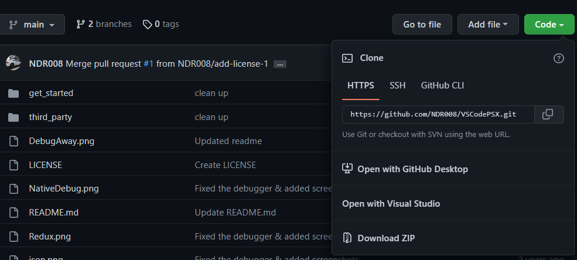

# VSCodePSX 

Major changes!

A basic setup to get coding for PSX on Win 10 64bit with VS Code  
Use modern day GCC with the unofficial official based SDK  
Guide by NDR008, many many contributors to this but definitely:
Schnappy, Nicolas, Sickle, danhans42 and Skitchin.


# Youtube Guide
<https://www.youtube.com/watch?v=Axyq_H_o8gI>

# Goals of this Repo
Many people follow tutorials and youtube videos that rely on people setting up virtual machines to use the original Psyq libraries and tookchains.

This repo is design to allow people to almost follow those tutorials without having to setup such vritual machines but work with modern OSes (I only care about Linux and Windows) while having the luxury of a modern IDE such as VSCode to do all the work from:
- Compile
- Debug together with PCSX-Redux OR real hardware running the latest beta unirom in conjunction with a special version of nops (the latter has not be tested by myself)

So in reality this repo is mostly a fudge of other people's work that I am not trying to take credit off.

## Most of the SDK magic
Most of the magic for getting psyq to work is comming from Nicolas and his nugget toolchain. If you want to compile openbios, and all the other magic nugget has (including a new alternative C++ library called psyqo - then do check his repo):
<https://github.com/pcsx-redux/nugget>

## NOPS that allows for GDB

The special version of NOPS is thanks to Skitching:
<https://github.com/johnbaumann/NOTPSXSerial/tree/branchybranch>

## Unirom

From the one and only:  
<https://github.com/JonathanDotCel/unirom8_bootdisc_and_firmware_for_ps1>

## PCSX-Redux

I use almost soley PCSX-Redux as my PSX emulator, it is a stable emulator with a lot of debugging and development features as well as a lua script engine (which I use for other projects).
For this guide, it will be mandatory to use PCSX-Redux (for the debugging function).
And if you are still using ePSXe... why?


# Setting Things Up
My setup focuses on Windows. I think those that are using Linux natively will know how to adjust the necessary things themselves.

My instructions however do allow for 3 methods.  

- Method 1a: Windows automated (using Nic's method)
- Method 1b: Windows natively  
- Method 2: Windows with WSL  

The main difference between the methods are how to acquire gcc for MIPS, gdb-multiarch and make. All are readily available on Ubuntu, and does, installing WSL and relying on Ubuntu to install those packages is an easy and reliable method.

However, thanks to Nicolas, there are also Windows builds of those tools.

So now we are spoiled for choice (and many more method of setting up psyq or alternative SDKs for the PSX).
This git is focused on Visual Studio Code configuration files should work for both methods, with minimal elements of nugget.

# Common Parts of setting up

Follow these steps no matter what method you will use.

## 0. Grab PCSX-Redux!

0.1. Download and unzip somewhere PCSX-Redux <https://install.appcenter.ms/orgs/grumpycoders/apps/pcsx-redux-win64/distribution_groups/public>  

## 1. Install Visual Studio and Commonly used Plugins

1.1. Install visual studio: <https://code.visualstudio.com/>  
1.2. Install the C/C++ extension package: <https://marketplace.visualstudio.com/items?itemName=ms-vscode.cpptools>  
1.3. Install the task explorer extension: <https://marketplace.visualstudio.com/items?itemName=spmeesseman.vscode-taskexplorer>  
1.4. Install the Github extension: <https://marketplace.visualstudio.com/items?itemName=GitHub.vscode-pull-request-github>  
1.5. Install GDB extension: <https://marketplace.visualstudio.com/items?itemName=webfreak.debug>  

## 2. Clone this repo and add psyq

2.1. If you are familiar with git, clone this repo, if not just download the repo as a zip.

2.2. Download the magic psyq library from here: <https://psx.arthus.net/sdk/Psy-Q/psyq-4.7-converted-full.7z> (you will need 7zip if you do not have it yet...)  
2.3. Unzip the contents into the ```third_party\psyq``` folder (be careful, there is already one file: inline_n.h inside ```third_party\psyq\include``` - do not lose it by overwriting the "include" folder from the the zip in step 2.2 over the existing "include").
  
# Steps for Windows (Nic script method):

Open the run promots and type:
```powershell -c "& { iwr -UseBasicParsing https://bit.ly/mips-ps1 | iex }"``` 
Then type ```mips``` followed by a restart to install the complete toolchain
(Goto #4)
  
# Steps for Windows natively setup (Method 1b)

The methods are not mutually excluse, but these steps are necessary for a Windows only setup.

## 3. Install gcc-mipsel on Windows

3.1. Download gcc mipsel from here: <https://static.grumpycoder.net/pixel/mips//g++-mipsel-none-elf-12.1.0.zip>  
(Nicolas is providing this binary, and he may release newer builds and may share them here: <https://static.grumpycoder.net/pixel/mips/>)  
3.2. Unzip gcc-mipsel to ```C:\g++-mipsel-none-elf-12.1.0\```  
3.3. Add ```C:\g++-mipsel-none-elf-12.1.0\bin``` to your PATH  
3.4. Download gdb-multiarch from here: <https://static.grumpycoder.net/pixel/gdb-multiarch-windows/gdb-multiarch-12.1.zip>  
(Nicolas is providing this binary, and he may release newer builds and may share them here: <https://static.grumpycoder.net/pixel/gdb-multiarch-windows/>)  
3.5. Unzip gdb-multiarch to ```C:\gdb-multiarch-12.1```

<https://marketplace.visualstudio.com/items?itemName=ms-vscode-remote.remote-wsl>  
(Goto #4)

# Steps for Windows with WSL (Method 2)

## 3. Install gcc-mipsel on WSL/Ubuntu
3.1. Add this plugin for visual studio:  <https://marketplace.visualstudio.com/items?itemName=ms-vscode-remote.remote-wsl>  
3.2. Winkey + R and type:    ```powershell start-process PowerShell -verb runas ```  
3.3. In Powershell Type:    ```dism.exe /online /enable-feature /featurename:Microsoft-Windows-Subsystem-Linux /all /norestart  ```  
3.4. Restart because it is Windows.  
3.5. Install: <https://apps.microsoft.com/store/detail/ubuntu-20044-lts/9MTTCL66CPXJ>  
3.6. (If the Ubuntu shell has not launched automatically) Winkey + R and type:    wsl  
3.7. Follow the instructions to setup a username and password  
3.8. When Ubuntu is ready type:  
  ```
  sudo apt-get update
  sudo apt-get install -y g++-mipsel-linux-gnu gdb-multiarch make gzip
```   
3.9. When above installations are done type "code ."   
VSCode should have launched connected to WSL  
(Goto #4)

## 4. Start Coding

4.1. Open PCSX-Redux  
4.2. Go to the `Configuration\Emulation` menu, and turn on GDB and enable ```Enable Debugger``` and ```Enable GDB Server```  
  
4.3. Open the ```get_started``` folder in Visual Studio  
4.4. In the terminal type "make"
4.5. Use the debugger in Visual Studo to debug your code or just load your HelloWorld.ps-exe to run it normally.  
4.6. Use the Task ```Run nops``` if you have a serial cable and unirom setup.  

# Note about WSL

If you use WSL2 instead of WSL(1) or change other settings you make have to modify launch.json and replace ```127.0.0.1``` with your actual local IP address like ```192.168.11.1``` (of your Windows machine).

I found that Windows 11 Developer Evaluation image came with WSL2, I changed the default before installing Ubuntu using: ```wsl --set-default-version 1```

Enjoy - code should halt/pause at the breakpoint, waiting for you to tell it to continue or not.  
