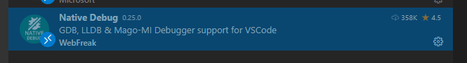
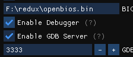
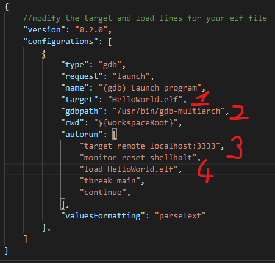
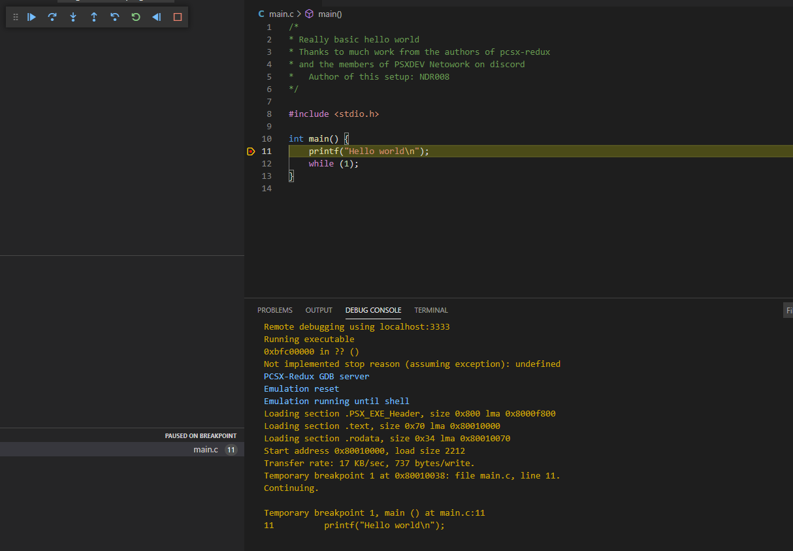

# VSCodePSX 
A basic setup to get coding for PSX on Win 10 64bit with VS Code  
Use modern day GCC with the unofficial official based SDK  
Guide by NDR008, many many contributors to this but definitely:
Schnappy, Nicolas, Sickle, and danhans42

https://youtu.be/HOVFs5ZtedI

## Step 0: Get work folder ready:  
- Clone this repo somewhere (if you want to skip git stuff for now.. just download the zip from the github).
- Unzip: *SDK* (the one made from parsing) into the third_party folder  
(Ask around for it)  
Check the readme here: https://github.com/NDR008/VSCodePSX/tree/main/third_party  
  
  
## Step 1a: Install gcc mipsel on windows:
http://static.grumpycoder.net/pixel/mips/g++-mipsel-none-elf-10.3.0.zip


## Step 1b: Install WSL and base extension:
a) https://code.visualstudio.com/  
b) https://marketplace.visualstudio.com/items?itemName=ms-vscode-remote.remote-wsl  

## Step 2: Get WSL and Ubuntu Ready (Skip if you follows 1a)
a) Winkey + R and type:    powershell start-process PowerShell -verb runas  
b) In Powershell Type:    dism.exe /online /enable-feature /featurename:Microsoft-Windows-Subsystem-Linux /all /norestart  
c) Restart just in case  
d) Install: https://www.microsoft.com/en-us/p/ubuntu-2004-lts/9n6svws3rx71?SilentAuth=1&wa=wsignin1.0&activetab=pivot:overviewtab  
e) Winkey + R and type:    wsl  
f) Follow the instructions to setup a username and passowrd  
g) When Ubuntu is ready type:  
  ```
  sudo apt-get update
  sudo apt-get install -y g++-mipsel-linux-gnu  
  sudo apt-get install -y make
```   
h) When above installations are done type "code ."  
(wait for some stuff to happen)  
  
VSCode should have launched connected to WSL  
  
## Step 3: Start Coding  
a) In VSCode: File, Open folder, and choose the "get_started" folder  
  
## Step 4: Compile  
a) From the menu, Terminal, New Terminal (unless a Terminal is already open)  
b) Type "make"  
c) If all went well an exe should appear that you can load into an emulator.  

## Optional step :
If you want to also debug with step functions and pcsx-redux than also:  
in WSL:   
```sudo apt-get install -y gdb-multiarch  ```  
and install this extension in VSCode (install in WLS too):  
https://marketplace.visualstudio.com/items?itemName=webfreak.debug  
make sure it is enabled  


Load open bios in pcsx-redux and make sure that make sure that debugging related options are on
  

If you use WSL2 instead of WSL(1) or change other settings you make have to modify launch.json
  
1) & 3) Make sure that the target & load lines match the right elf file.  
2) if you are using a non linux or alternative gdb somehow, obviously change the gdb bin location.  
4) assuming you are running redux on the same machine, then localhost *should* be fine, but I found that it does not work on WSL2. Instead you have to type the local IP address (like 192.168.1.10)...  
  
Then off you are to debug.  
  
- Open pcsx-redux  
- Open your source file  
- Add breakpoints (red dot near your target line number)  
- Switch to the Debug extension from the left pain (Play with bug icon)  
- Run the debugger  

Enjoy - code should halt/pause at the breakpoint, waiting for you to tell it to continue or not.  

